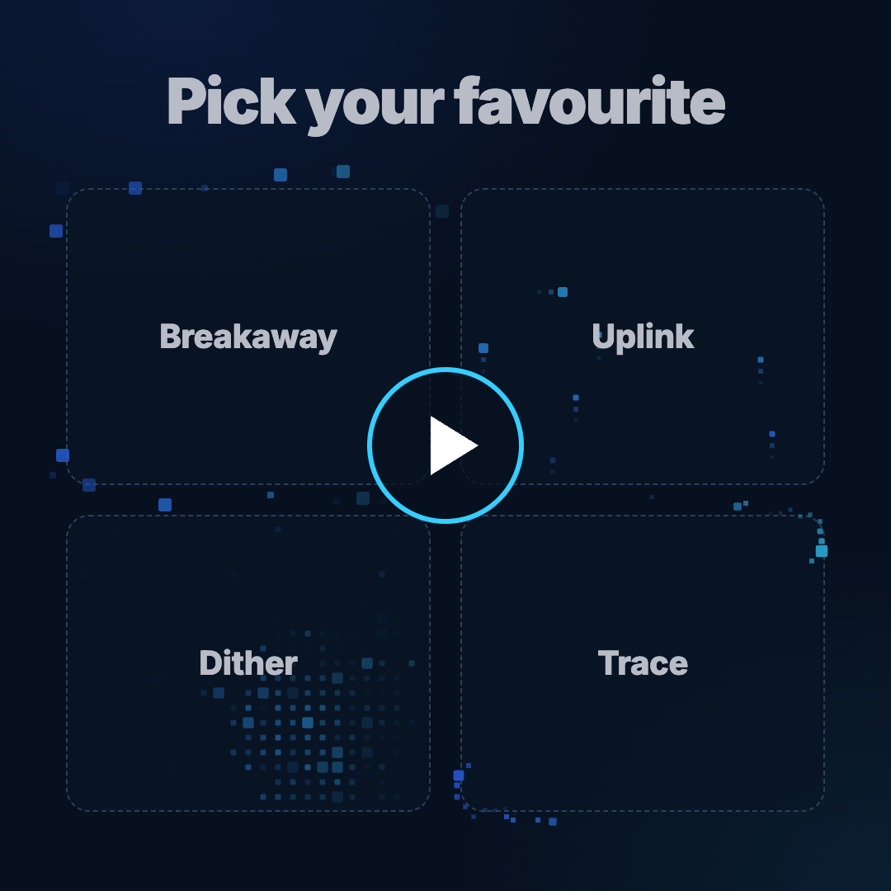
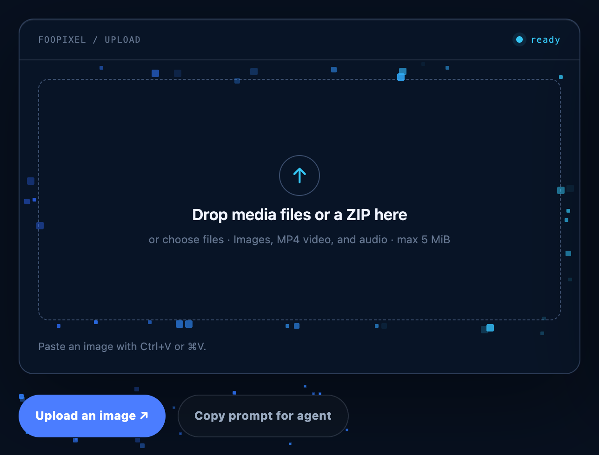
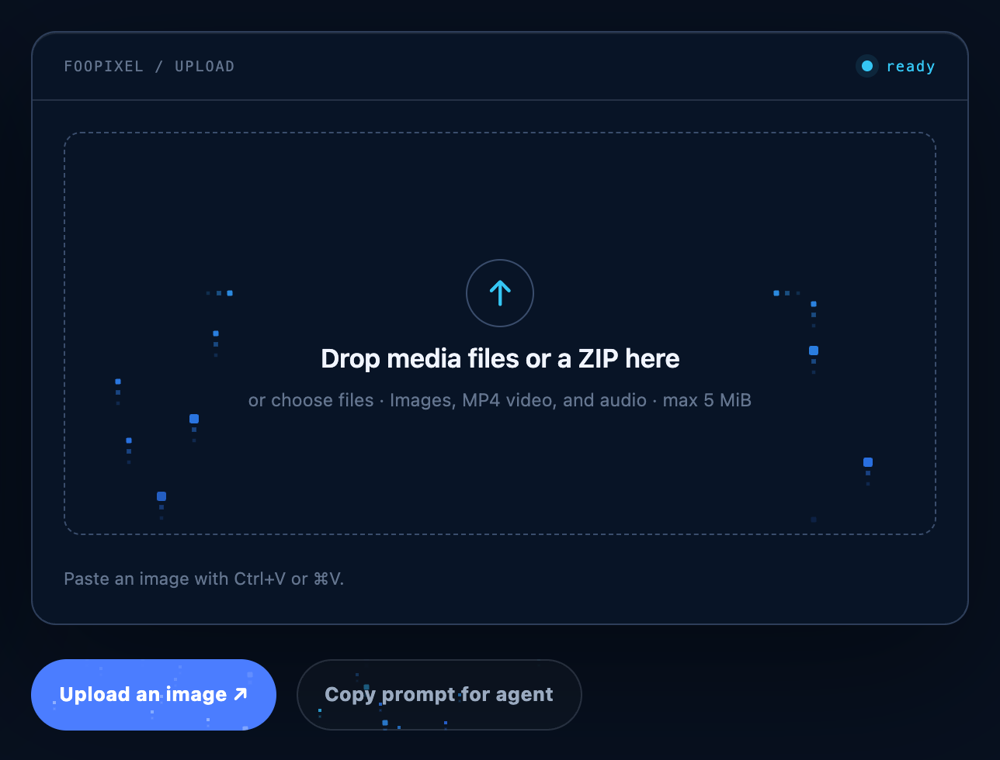
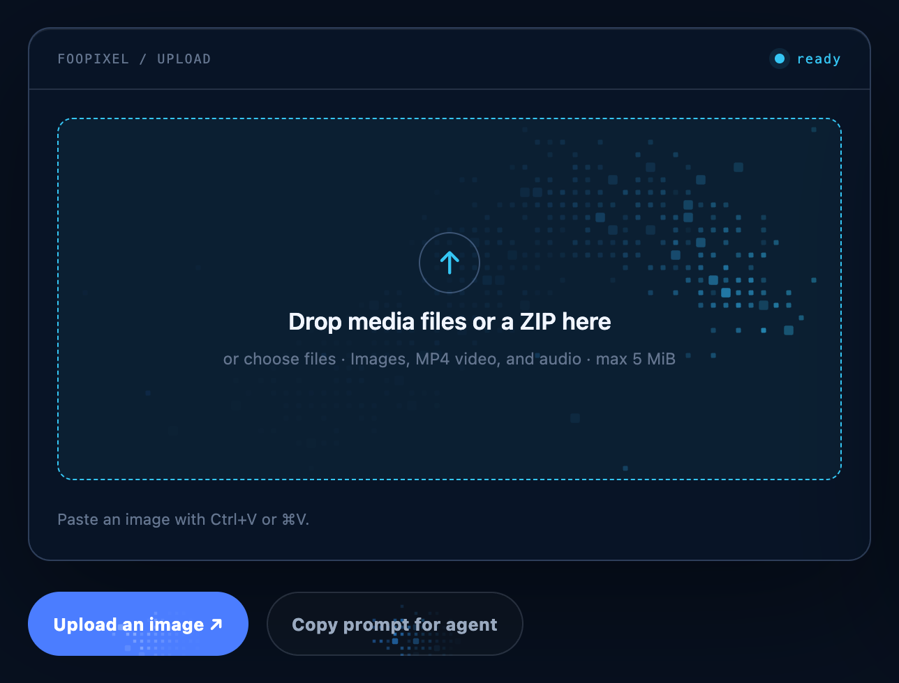
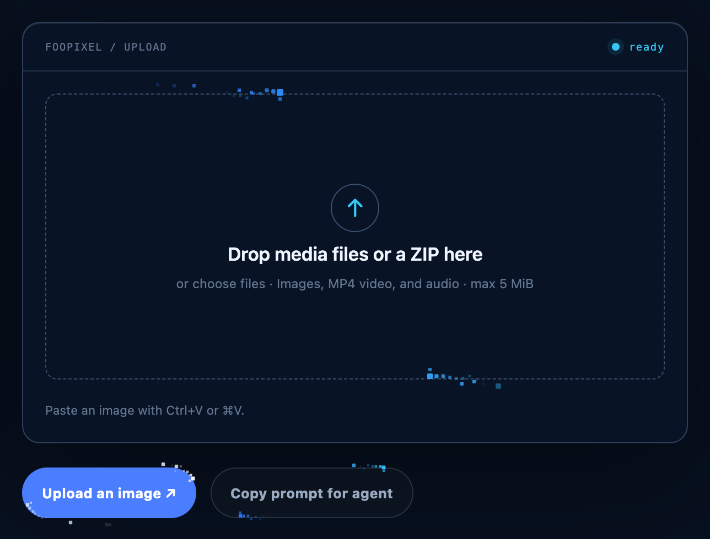
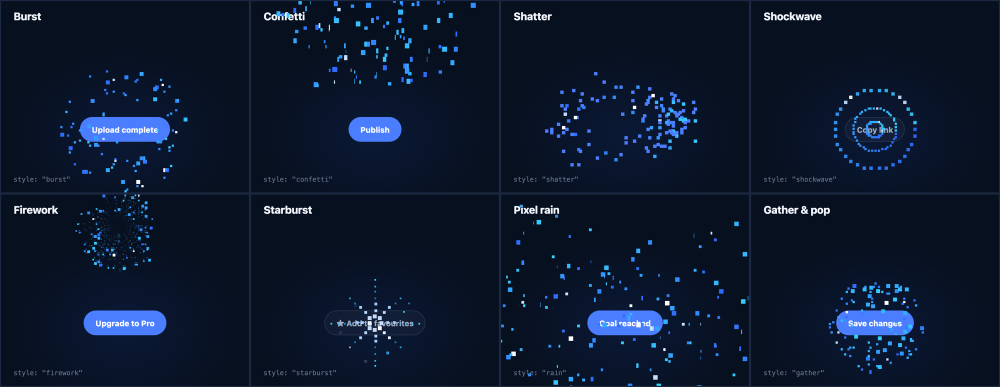
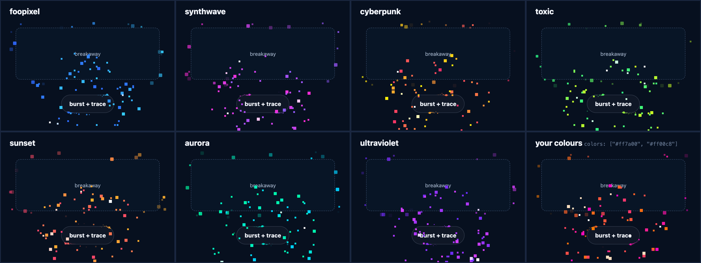

# FooPixel FX

Pixel hover effects and bursts for drop zones and buttons, based on the pixels breaking off the FooPixel logo.

- **Hover effects**: `breakaway`, `uplink`, `dither` and `trace`. Each one draws on a canvas it adds to the element and runs only while the element is hovered, focused, dragged over or held active.
- **Bursts**: `burst`, `confetti`, `shatter`, `shockwave`, `firework`, `starburst`, `rain` and `gather`. These are one-off pixel celebrations, like confetti, that you fire from a click or any other event.

Both come in the FooPixel blue and six neon colour schemes, or your own colours. The library has no dependencies and is about 10 KB gzipped.

<p align="center">
  <a href="docs/foopixel-fx-showcase.mp4"></a>
  <br>
  <a href="docs/foopixel-fx-showcase.mp4"><strong>▶ Watch the 18-second showcase</strong></a>
</p>

## Hover effects

These are stills of each effect running on a drop zone and two buttons. To see them move, watch the [showcase video](docs/foopixel-fx-showcase.mp4) or open `demo/index.html`.

<table>
  <tr>
    <td width="50%"></td>
    <td width="50%"></td>
  </tr>
  <tr>
    <td><strong><code>breakaway</code></strong>: pixels detach from every edge and step outward, shading blue to cyan.</td>
    <td><strong><code>uplink</code></strong>: pixels climb the sides and turn in to the upload icon. Buttons fizz with rising pixels.</td>
  </tr>
  <tr>
    <td width="50%"></td>
    <td width="50%"></td>
  </tr>
  <tr>
    <td><strong><code>dither</code></strong>: a hidden pixel grid lights up under the cursor and fades behind it.</td>
    <td><strong><code>trace</code></strong>: two pixel trails run along the border. Also works as a loading state.</td>
  </tr>
</table>

## Bursts

Fire one from a button click, a finished upload, a saved form or any other moment worth marking. Open `demo/bursts.html` to try them all, with sliders for amount, size, gravity and speed.



| Style | What it does | Good for |
|---|---|---|
| `burst` | Pixels fly out in every direction, arc down and halve in size before they vanish | Anything; the default |
| `confetti` | A cannon of tumbling pixel confetti fired up from the element's top edge | Publish, launch, sign-up |
| `shatter` | The element breaks into its own pixels from the point you clicked, then snaps back | Remove, reset, clear |
| `shockwave` | Three pixel rings roll outward like a sonar ping | Copy, small confirmations |
| `firework` | A pixel rocket climbs, then bursts into twinkling, crackling sparks | Upgrades, achievements |
| `starburst` | 8-bit sparkle: rays step out along eight directions, then a second pale wave | Favourite, like, star |
| `rain` | Pixels rain down over the whole page, with a small pop where you clicked | Big milestones |
| `gather` | Pixels are pulled in to the point, hold for a beat, then pop outward | Save, submit, complete |

## Colour schemes

Every hover effect and burst uses the FooPixel blue-to-cyan gradient by default. Six neon schemes are built in, and they're made for dark backgrounds. You can switch the whole page, or set a scheme on one element or one burst.



| Scheme | Gradient |
|---|---|
| `foopixel` | blue `#2e68ff` → cyan `#35ceff` (default) |
| `synthwave` | hot pink `#ff2bd6` → violet `#8f5bff` |
| `cyberpunk` | yellow `#fcee0a` → hot pink `#ff2a6d` |
| `toxic` | green `#2bff88` → lime `#d4ff1f` |
| `sunset` | pink `#ff3c6f` → amber `#ffb02e` |
| `aurora` | mint `#00ffa3` → aqua `#00d0ff` |
| `ultraviolet` | indigo `#6a2cff` → orchid `#e040ff` |

```js
PixelFX.configure({ scheme: "synthwave" });                   // the whole page
PixelFX.attach(el, "trace", { scheme: "toxic" });             // one element
PixelFX.burst(button, { style: "firework", scheme: "sunset" }); // one burst
PixelFX.burst(button, { colors: ["#ff7a00", "#ff00c8"] });      // your own two colours
```

```html
<div data-pixel-fx="breakaway" data-pixel-scheme="cyberpunk">…</div>
<button data-pixel-burst="confetti" data-pixel-burst-scheme="aurora">Publish</button>
<button data-pixel-burst data-pixel-burst-colors="#ff7a00,#ff00c8">Save</button>
```

With your own colours, the pale sparks and the Uplink ring are worked out from the pair. Two colours from opposite sides of the colour wheel, like orange and cyan, blend through a muddy grey in the middle, so neighbouring colours give a cleaner gradient.

## Install

Plain script tag. This sets `window.PixelFX` and attaches to every `[data-pixel-fx]` element on the page once the DOM is ready:

```html
<script src="/assets/foopixel-fx.min.js" defer></script>
```

Add `data-manual` to the script tag if you'd rather call `PixelFX.scan()` yourself.

ES module. Nothing attaches automatically:

```js
import PixelFX from "/assets/foopixel-fx.esm.min.js";
PixelFX.scan();
```

## Use it with data attributes

```html
<div class="upload-zone" data-pixel-fx="breakaway" data-pixel-preset="zone">…</div>

<a class="button button-primary" data-pixel-fx="trace" data-pixel-preset="button" data-pixel-fill="light">Upload an image ↗</a>
<a class="button button-quiet"   data-pixel-fx="trace" data-pixel-preset="button">Read the docs</a>
```

| Attribute | Values | Default |
|---|---|---|
| `data-pixel-fx` | `breakaway`, `uplink`, `dither`, `trace` | required |
| `data-pixel-preset` | `zone` for drop areas and panels, `button` for CTAs | `zone` |
| `data-pixel-fill` | `light` for pale pixels on filled buttons | none |
| `data-pixel-density` | multiplier for this element, e.g. `0.6` | `1` |
| `data-pixel-speed` | multiplier for this element | `1` |
| `data-pixel-drag` | `false` to ignore files dragged over it | `true` on zones |
| `data-pixel-target` | Uplink: selector for the icon pixels flow into | `[data-pixel-icon], .upload-symbol` |
| `data-pixel-avoid` | Uplink: selector for the text pixels route around | `[data-pixel-text], .empty-upload` |
| `data-pixel-pulse` | Uplink: `false` to stop the icon ring pulse | `true` |
| `data-pixel-scheme` | a [colour scheme](#colour-schemes) for this element | global colours |
| `data-pixel-colors` | your own gradient for this element, e.g. `#ff7a00,#ff00c8` | none |

With Uplink you can also mark the elements directly instead of passing selectors: put `data-pixel-icon` on the icon and `data-pixel-text` on the text block.

### Bursts on click

```html
<button data-pixel-burst="confetti">Publish</button>
<button data-pixel-burst="firework" data-pixel-burst-amount="1.5">Upgrade to Pro</button>
```

| Attribute | Values | Default |
|---|---|---|
| `data-pixel-burst` | any burst style: `burst`, `confetti`, `shatter`, `shockwave`, `firework`, `starburst`, `rain`, `gather` | `burst` |
| `data-pixel-burst-amount` | multiplier on the number of pixels | `1` |
| `data-pixel-burst-size` | multiplier on pixel size | `1` |
| `data-pixel-burst-speed` | multiplier on speed | `1` |
| `data-pixel-burst-scheme` | a [colour scheme](#colour-schemes) for this burst | global colours |
| `data-pixel-burst-colors` | your own gradient, e.g. `#ff7a00,#ff00c8` | none |

`PixelFX.scan()` turns this on, so it works straight away with the script tag. It uses one click listener on the document, which also covers elements added to the page later. A keyboard press on the button fires it too.

## JavaScript API

```js
const fx = PixelFX.attach(el, "trace", { preset: "zone", density: 0.8, scheme: "aurora" });

fx.setActive(true);   // keep running regardless of hover
fx.setActive(false);  // back to hover / focus / drag
fx.refresh();         // re-measure after the element's size or content changes
fx.destroy();         // remove canvas, listeners and inline styles

PixelFX.scan(root);   // attach to [data-pixel-fx] under root; skips ones already attached
PixelFX.get(el);      // instance or null
PixelFX.destroy(el);
PixelFX.all();        // every live instance

PixelFX.configure({
  density: 1,
  speed: 1,
  respectReducedMotion: true,
  maxDpr: 2,
  scheme: "foopixel",               // any colour scheme; applied before colors
  colors: {
    brand: ["#2e68ff", "#35ceff"],  // blue to cyan
    light: ["#c4deff", "#ffffff"],  // used with data-pixel-fill="light"
    pulse: "#35c6f4",               // Uplink icon ring
  },
});
```

### Bursts

```js
PixelFX.burst(button);                                 // from the element's centre
PixelFX.burst(button, { style: "firework" });
PixelFX.burst({ x: e.clientX, y: e.clientY });         // from a point in the viewport
PixelFX.burst(button, {
  style: "confetti",
  amount: 1.5,                        // more pixels
  size: 1,                            // pixel size
  speed: 1,                           // on top of the global speed
  gravity: 1,                         // 0 lets pixels float
  snap: true,                         // snap to a coarse grid for a crisp, retro look
  scheme: "synthwave",                // this burst only; defaults to the global colours
});
PixelFX.burst(button, { style: "shatter", origin: { x: e.clientX, y: e.clientY } }); // where the break starts

PixelFX.bursts;                       // every style name
PixelFX.schemes;                      // every colour scheme name
```

`burst()` returns `false` when nothing was drawn, for example when reduced motion is on. It fires straight away and doesn't need `scan()`. Bursts use the global `speed`, `maxDpr`, `respectReducedMotion` and `colors` settings from `configure()`, with `colors.light` for the pale sparks.

TypeScript types are in `dist/foopixel-fx.d.ts`.

### Upload in progress

Trace works as a loading state. Hold it on while the upload runs:

```js
const zoneFx = PixelFX.get(document.querySelector("[data-upload-zone]"));
zoneFx.setActive(true);
await upload(file);
zoneFx.setActive(false);
```

## How it fits into your layout

The library changes two things on the element it's attached to, and puts both back on `destroy()`:

- If the element is `position: static`, it gets `position: relative`.
- It gets `isolation: isolate`. This lets the canvas sit at `z-index: -1`, above the element's own background but below its content, so the content needs no z-index changes.

Breakaway and Trace draw a little outside the element. If an ancestor has `overflow: hidden`, it needs this much room around the element or it will cut the pixels off:

| Effect | Zone | Button |
|---|---|---|
| Breakaway | 18px | 16px |
| Trace | 12px | 8px |
| Uplink, Dither | 0 | 0 |

The FooPixel uploader already has room for this: the zone sits inside the panel with a 20px margin.

Drag events are only observed. The library never calls `preventDefault()` and never adds classes, so your upload code stays in charge of drops.

Bursts don't touch your layout. They draw on one shared canvas fixed over the whole viewport (`z-index: 2147483000`), which is added on the first burst and removed once the last pixel has gone. They're positioned in the viewport, so a burst stays where it was fired if the page scrolls. The one exception is `shatter`: it sets `visibility: hidden` on the element for about a second while its pixels fall, then puts it back.

## Accessibility and performance

- The canvas is `aria-hidden` and ignores pointer events.
- Keyboard focus (`:focus-visible`) starts the effect, the same as hover.
- By default, nothing animates when the user has reduced motion turned on, including bursts. To override that, pass `respectReducedMotion: false`.
- Each element runs its own `requestAnimationFrame` loop, only while it's active or fading out, then stops completely. Bursts share a single loop that stops when the last pixel has gone. Nothing runs when the page is idle.
- Canvas resolution is capped at 2× device pixel ratio (`maxDpr`).

## Build

`src/` holds the source. `./build.sh` rebuilds `dist/` and needs Node for `npx terser`. Open `demo/index.html` to compare the hover effects, using the sliders and the "keep running" toggle, and `demo/bursts.html` to try the bursts.

```
dist/foopixel-fx.js          script tag, readable
dist/foopixel-fx.min.js      script tag, minified
dist/foopixel-fx.esm.js      ES module, readable
dist/foopixel-fx.esm.min.js  ES module, minified
dist/foopixel-fx.d.ts        types
```

## License

MIT. See [LICENSE](LICENSE).
